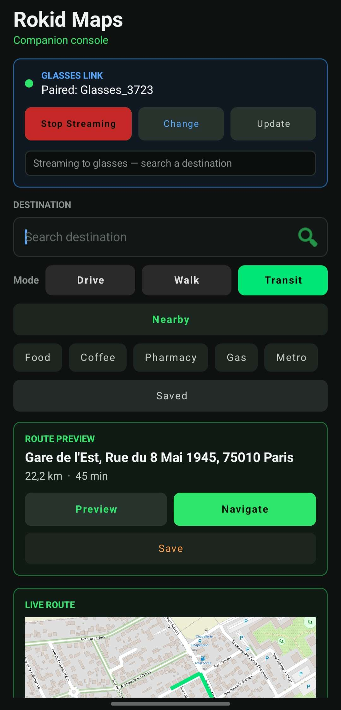
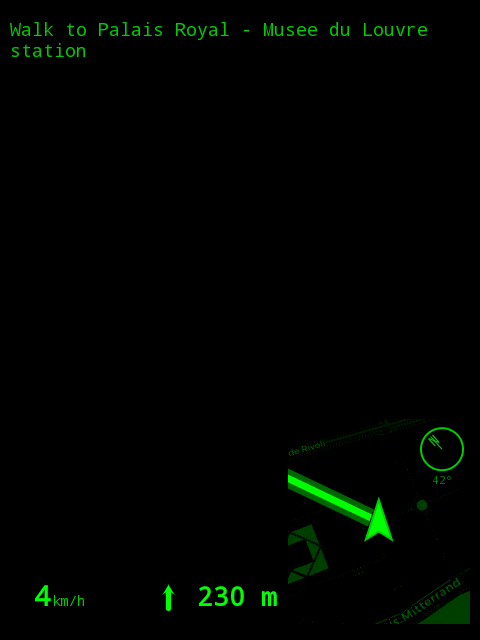
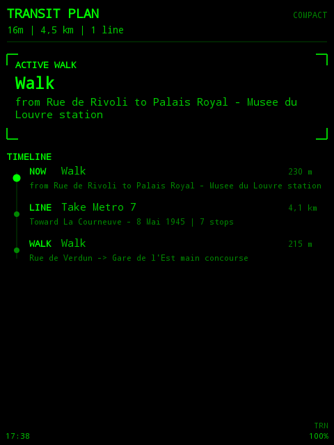
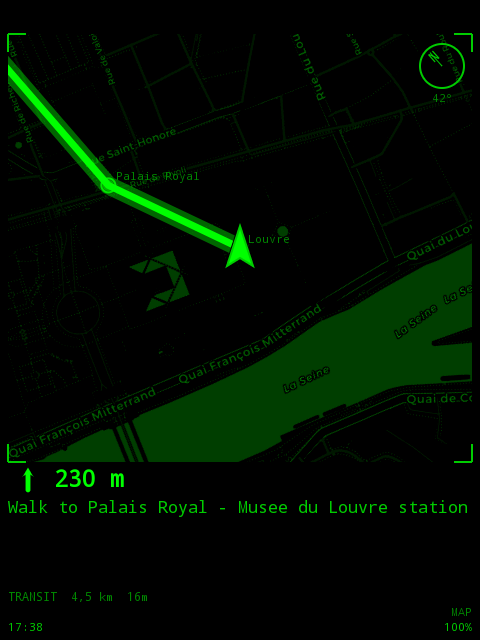

# Rokid-GMaps

<p align="center">
  
</p>

<h3 align="center">Phone companion + Rokid glasses navigation HUD</h3>

<p align="center">
  
  
  
  
</p>

<p align="center">
  
  
  <a href="https://www.buymeacoffee.com/charleshartmann"></a>
</p>

`Rokid-GMaps` is a reworked fork of `Rokid-Maps` for a phone-plus-glasses setup. The phone handles search, route calculation, providers, and map preview; the glasses render a lean green HUD for navigation.

## Screenshots

<p align="center">
  
</p>

<p align="center">
  
  
  
</p>

## Highlights

| Block | What it does |
| --- | --- |
| Phone companion | Search destinations, preview routes, choose drive/walk/transit, and stream state to the glasses. |
| Glasses HUD | Shows turn guidance, mini/full map modes, route metadata, transit recap, and connection status on a 480x640 display. |
| Provider model | Keeps OSM/Nominatim/OSRM fallback while allowing optional Google Places and Google Routes support. |
| Transit flow | Phone-side Google Routes can calculate transit; the glasses show a compact line-by-line plan. |
| Map tiles | Glasses can draw cached/proxied map tiles while staying lightweight for Android Go / wearable constraints. |

## Project Layout

| Module | Purpose |
| --- | --- |
| `phone/` | Android phone app, companion console, search, route calculation, Bluetooth streaming, settings. |
| `glasses/` | Rokid HUD app for the glasses display and navigation rendering. |
| `shared/` | Shared protocol messages, codecs, route models, and tile cache helpers. |

## Provider Model

| Feature | Default | Optional |
| --- | --- | --- |
| Place search | OSM / Nominatim | Google Places API |
| Route calculation | OSRM | Google Routes API |
| Transit routing | Not available through OSRM | Google Routes API |
| API key storage | None required for fallback | Entered in the phone app settings |

Google is only used when enabled and when an API key is present.

## Google Setup

Enable billing and these APIs in Google Cloud:

- `Places API`
- `Routes API`

Then open the phone app and set:

1. `Google API key`
2. `Use Google search`
3. `Use Google routes`

## Build

From the project root:

```powershell
.\gradlew.bat assembleDebug
```

Outputs:

| App | APK |
| --- | --- |
| Phone companion | `phone/build/outputs/apk/debug/phone-debug.apk` |
| Glasses HUD | `glasses/build/outputs/apk/debug/glasses-debug.apk` |

## Current Scope

| Done | Still evolving |
| --- | --- |
| Phone + glasses navigation architecture | More polished provider UX |
| Optional Google search/routes providers | Backend/proxy for securing Google API keys |
| Drive, walk, and transit route modes | Deeper merge with `Clawsses` |
| Route preview and glasses HUD screenshots | Richer transit/subway fusion |

## Support

If this project helps you build with Rokid glasses, you can support it here:

<p align="center">
  <a href="https://www.buymeacoffee.com/charleshartmann"></a>
</p>
